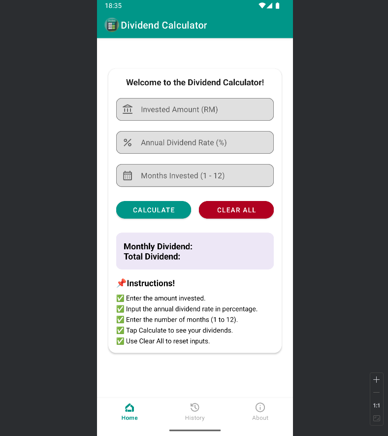
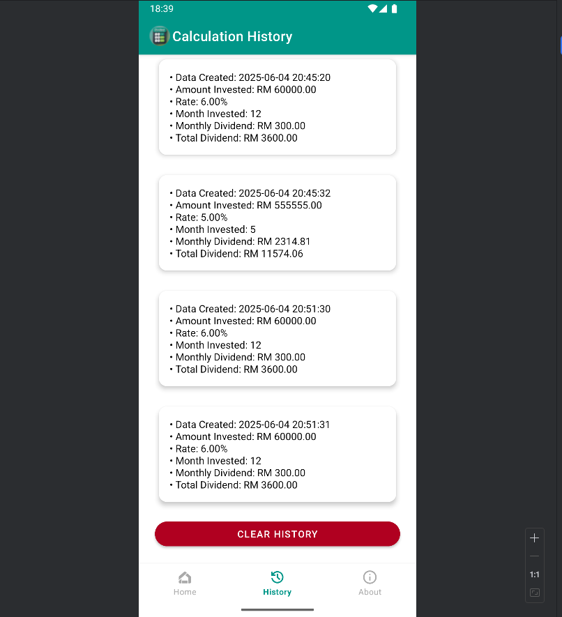
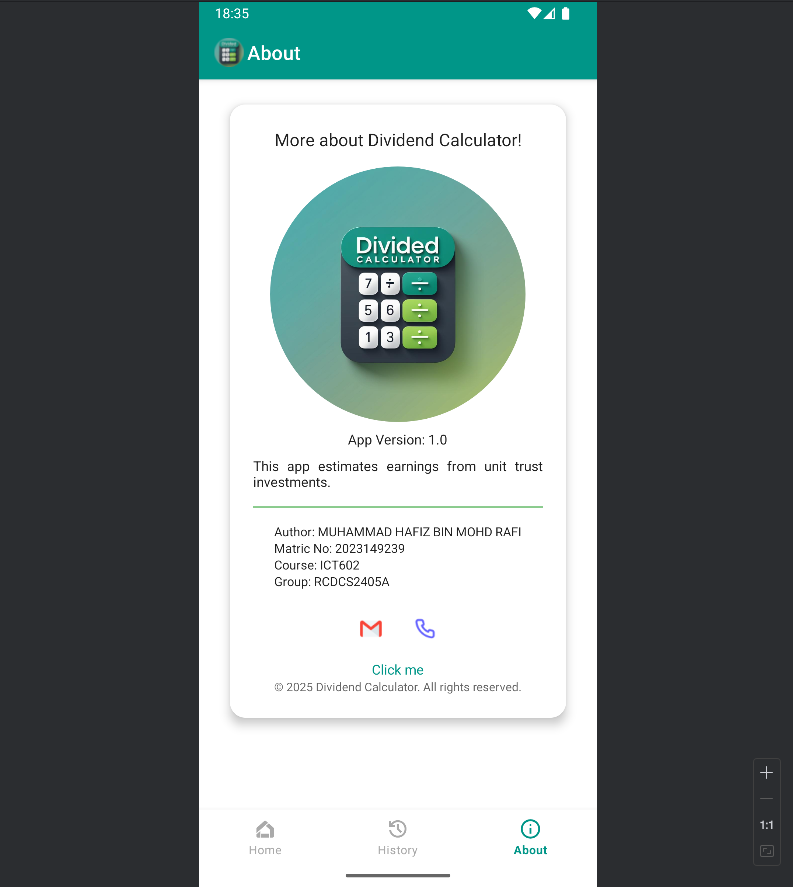

# 📱 DividendCalc - Unit Trust Dividend Calculator App

## 📝 Description
**Dividend Calculator** is a mobile Android application designed to help users calculate the dividend from their unit trust investments. Users simply enter their invested fund amount, annual dividend rate, and number of months invested (up to 12 months), and the app will compute and display both the monthly and total dividends.

This application is developed as part of the **Mobile Technology and Development** course assignment (Individual Lab Assignment 2025).

---

## 🔢 Features
- Simple and responsive UI with modern mobile-first design
- Input fields for:
    - Invested Fund Amount
    - Annual Dividend Rate (%)
    - Number of Months Invested (1–12)
- Real-time calculation:
    - **Monthly Dividend = (Rate / 12) × Invested Fund**
    - **Total Dividend = Monthly Dividend × Number of Months**
- Displays output in 2 decimal places
- Navigation menu with:
    - **Home**
    - **History**
    - **About**
- About Page includes:
    - App icon
    - Author info
    - Clickable GitHub link
    - Contact icons (email, phone)
    - Copyright declaration

---

## 🖥️ Screenshots

| Home Page                     | History Page                        | About Page                      |
|-------------------------------|-------------------------------------|---------------------------------|
|  |  |  |

---

## 🔗 GitHub Repository

GitHub Source Code: [Click here](https://github.com/shenzzuu/Dividend-Calc.git)

---

## 🧑‍💻 Author

- **Name**: MUHAMMAD HAFIZ BIN MOHD RAFI
- **Matric Number**: 2023149239
- **Course**: ICT602
- **Group**: RCDCS2405A

---

## ⚙️ Technologies Used

- Java
- Android Studio (API 30)
- XML (for layout design)

---

## 📜 License

MIT License © 2025 Dividend Calculator

---

## 📽️ Presentation Video

Watch the 5-minute video demo: [Link to YouTube or Google Drive video](https://youtu.be/s3GSj4pJdpEz)

---

## 🔍 Example Calculation

> Invested: RM50,000  
> Dividend: 5.0%  
> Months: 12  
> ➤ Monthly Dividend = RM208.33  
> ➤ Total Dividend = RM2,500.00

---

## 📁 Folder Structure (Important Files)
DividendCalc/
├── app/
│   ├── manifests/
│   │   └── AndroidManifest.xml
│   ├── java/
│   │   └── com.example.dividendcalc/
│   │       ├── AboutActivity.java
│   │       ├── HistoryActivity.java
│   │       ├── HistoryStorage.java
│   │       └── MainActivity.java
│   ├── res/
│   │   ├── color/
│   │   │   └── nav_item_selector.xml
│   │   ├── drawable/
│   │   │   ├── about.xml
│   │   │   ├── divider.xml
│   │   │   ├── history.xml
│   │   │   ├── home.xml
│   │   │   ├── invest.xml
│   │   │   ├── rate.xml
│   │   │   ├── month.xml
│   │   │   ├── phone.png
│   │   │   ├── mail.png
│   │   │   ├── logo.png
│   │   │   ├── ic_logo.png
│   │   │   ├── ic_launcher_background.xml
│   │   │   ├── ic_launcher_foreground.xml
│   │   │   ├── result_bg.xml
│   │   │   ├── rounded_bg.xml
│   │   │   ├── rounded_image.xml
│   │   │   └── splash_background.xml
│   │   ├── layout/
│   │   │   ├── activity_about.xml
│   │   │   ├── activity_history.xml
│   │   │   └── activity_main.xml
│   │   ├── menu/
│   │   ├── mipmap/
│   │   └── values/
│   │       ├── colors.xml
│   │       ├── colors.xml (night)
│   │       ├── strings.xml
│   │       ├── themes.xml
│   │       └── themes.xml (night)
├── build.gradle
├── screenshots
├── settings.gradle
└── README.md